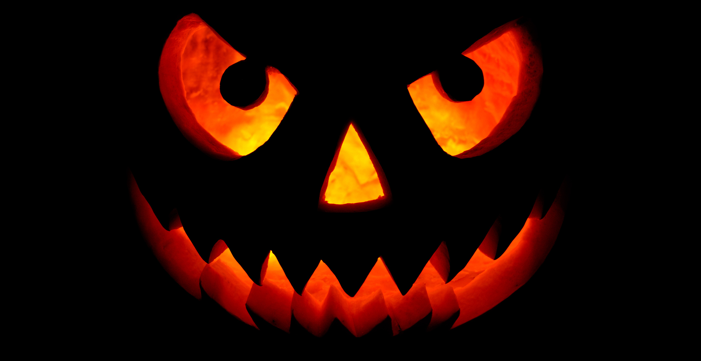

<!-- 🎃 Clean Halloween Neon Edition by Zen -->

  <!-- Banner -->
  

  <!-- Orange static text -->
   
  <h2 style="color:#FFA500; font-family:monospace;">
    ⭐ Stars on my repos or treats 🍬
  </h2>

  <!-- Neon flicker animated text -->
   
  

    

  <!-- Neon badges -->
  
  

